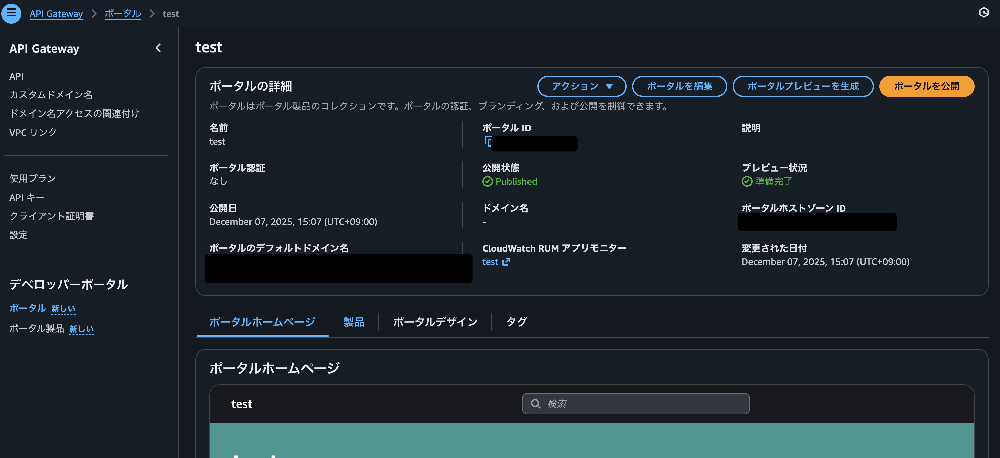
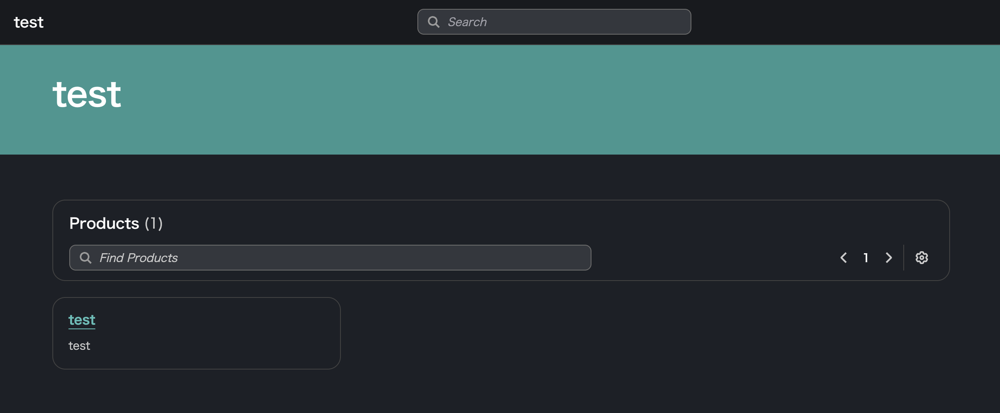
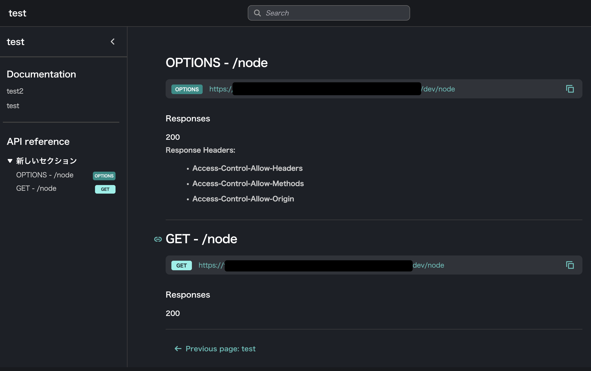

# AWS API Gateway Portal

- re:Invent 2025 の直前に発表された機能
- API Gateway の dev portal を作れる
- Swagger UI 相当
  - 試してないが try it out 等もできる
  - カスタムでドキュメントをおける（マークダウン形式）
- 構成要素として「ポータル」と「ポータル製品」というものがある
  - ポータルでは、ドメインや認証情報を設定する。でポータル製品を選択する
  - ポータル製品は、API のドキュメントそのもの。ここで順番を並び替えたり追加のページを作成したりできる
  - なぜポータルとポータル製品とでリソースが分かれているのかは不明だが、おそらく大規模なAPIを想定しているのでは。API がいくつかある時にドキュメントをまとめられるよう。ポータル製品にはリソースポリシー等もあったので、クロスアカウントで共有できるのだと思う
- SSG しているっぽい
  - レスポンスボディを見るとS3ベースっぽい
  - で「ポータルを公開」というボタンを押さないと反映されなかったっぽいので、内部でSSGしていると想像
  - 
- astro ベースっぽい
- 見た目
  - 
  - 
- 料金は高い
  - ポータルで$147.00/月
  - ポータル製品で$14.70/月
  - この料金だと仮にたてるにしてもクロスアカウントでまとめたいと思うレベル