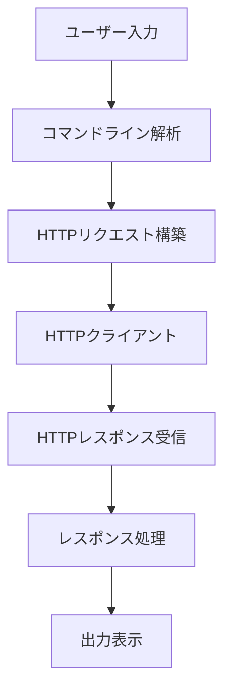

# 設計ドキュメント

## 概要

このドキュメントでは、curlよりもシンプルで使いやすいHTTPリクエスト用CLIツールの設計について説明します。このツールは「simplecurl」（仮称）と呼び、最小限の機能セットに焦点を当て、特にAPIリクエストの送信を簡素化することを目的としています。

## アーキテクチャ

「simplecurl」は以下のコンポーネントで構成されます：

1. **コマンドラインインターフェース**: ユーザー入力を解析し、適切なHTTPリクエストを構築します。
2. **HTTPクライアント**: 実際のHTTPリクエストを送信し、レスポンスを受け取ります。
3. **レスポンス処理**: HTTPレスポンスを解析し、ユーザーに読みやすい形式で表示します。



## コンポーネントとインターフェース

### 1. コマンドラインインターフェース

このコンポーネントは、ユーザーからの入力を解析し、適切なHTTPリクエストを構築する役割を担います。

**主な機能**:
- コマンドライン引数の解析
- ヘルプメッセージの表示
- エラーハンドリング

**コマンド構文**:
```
simplecurl [URL] [オプション]
```

**基本オプション**:
- `-X, --method METHOD`: HTTPメソッドを指定（GET、POST、など）
- `-d, --data DATA`: リクエストボディとして送信するデータ
- `-H, --header HEADER`: リクエストヘッダーを追加
- `-h, --help`: ヘルプメッセージを表示

**使用例**:
```
# GETリクエスト
simplecurl https://api.example.com/data

# POSTリクエスト（JSONデータ）
simplecurl https://api.example.com/data -X POST -d '{"name": "test"}' -H "Content-Type: application/json"
```

### 2. HTTPクライアント

このコンポーネントは、実際のHTTPリクエストを送信し、レスポンスを受け取る役割を担います。

**主な機能**:
- HTTPリクエストの送信
- HTTPレスポンスの受信
- タイムアウト処理
- リダイレクト処理

**インターフェース**:
```
sendRequest(url, method, headers, body) -> Response
```

### 3. レスポンス処理

このコンポーネントは、HTTPレスポンスを解析し、ユーザーに読みやすい形式で表示する役割を担います。

**主な機能**:
- レスポンスステータスコードの表示
- レスポンスヘッダーの表示（オプション）
- レスポンスボディの表示
- JSONレスポンスの整形表示

## データモデル

### HTTPリクエスト

```
Request {
  url: string
  method: string (GET, POST, PUT, DELETE, PATCH)
  headers: Map<string, string>
  body: string | null
}
```

### HTTPレスポンス

```
Response {
  statusCode: number
  headers: Map<string, string>
  body: string | null
  contentType: string
}
```

## エラーハンドリング

以下のエラーケースを考慮します：

1. **無効なURL**: ユーザーが無効なURLを指定した場合、明確なエラーメッセージを表示します。
2. **ネットワークエラー**: ネットワーク接続の問題が発生した場合、エラーの詳細を表示します。
3. **タイムアウト**: リクエストがタイムアウトした場合、適切なメッセージを表示します。
4. **HTTPエラー**: サーバーがエラーレスポンス（4xx、5xx）を返した場合、ステータスコードと詳細を表示します。

## テスト戦略

以下のテストを実施します：

1. **ユニットテスト**: 各コンポーネントの機能を個別にテストします。
   - コマンドライン解析のテスト
   - HTTPクライアントのモックを使用したテスト
   - レスポンス処理のテスト

2. **統合テスト**: コンポーネント間の連携をテストします。
   - エンドツーエンドのリクエスト処理フロー

3. **クロスプラットフォームテスト**: LinuxとmacOSの両方で動作確認を行います。

## 実装言語と依存関係

実装言語として、クロスプラットフォーム対応と依存関係の少なさを考慮して、以下のいずれかを選択します：

1. **Go言語**:
   - クロスプラットフォームのバイナリを簡単に生成可能
   - 標準ライブラリにHTTPクライアントが含まれている
   - 依存関係の管理が容易

2. **Rust言語**:
   - パフォーマンスが高く、メモリ安全
   - reqwestライブラリを使用してHTTPリクエストを処理可能
   - クロスプラットフォームのバイナリを生成可能

3. **Node.js**:
   - 広く使われており、多くの開発者が馴染みがある
   - axiosやnode-fetchなどのHTTPクライアントライブラリが利用可能
   - pkg等を使用してスタンドアロンバイナリを生成可能

最終的な選択は、開発チームのスキルセットや好みに応じて決定します。この設計ドキュメントでは、Go言語を使用した実装を想定して進めます。