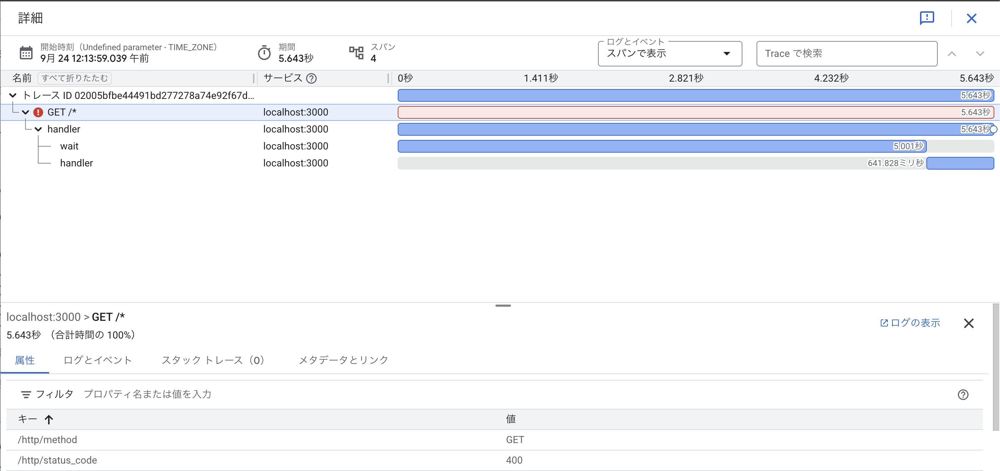

# Cloud Trace

- なんとなく知っていたが触ったことはないのでトライ
- まあこんなもんかという感じ
- AWS X-Ray よりは見やすいが、めちゃくちゃ見やすいわけではない
  - というかコンソールで操作しているやつ？も入ってくるっぽい？のでノイズが多い
- 直接 Google Cloud に送る構成にした
  - otel collector を挟んだ方がいい
  - 調査不足で otel collector 経由で送る例を見つけられなかった
  - Cloud Run とかにデプロイしたら勝手に取得されるイメージもあるので、他の方法もあるのかな？
- 必要十分ではあるので、Google Cloud でアプリケーションの構築をし始めた段階なら躊躇なく入れるかも
  - 本番運用直前に、datadog とか使うか検討する感じに自分はしそうだな〜と思った

## Links
- https://zenn.dev/cloud_ace/articles/opentelemetry-go

## スクショ

