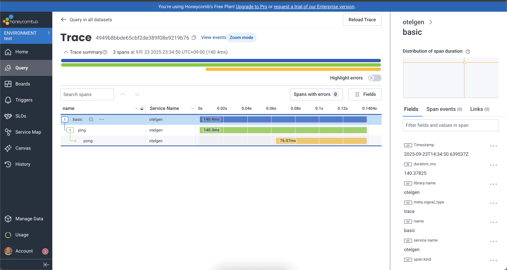

# honeycomb

- 前から気になっていたのでトライ。
- すごいシンプルなサービス
  - AWS X-Ray (CloudWatch Application Signals) と大体同じような機能がある
- 入門にはぴったりだと思う。
- クエリは datadog 並かな。
  - datadog は検索が難しいから相対的に使いやすそう。

otelgen でデータを生成するには

```bash
otelgen --otel-exporter-otlp-endpoint api.honeycomb.io:443 --header x-honeycomb-team=xxx traces single
```

スクショ


