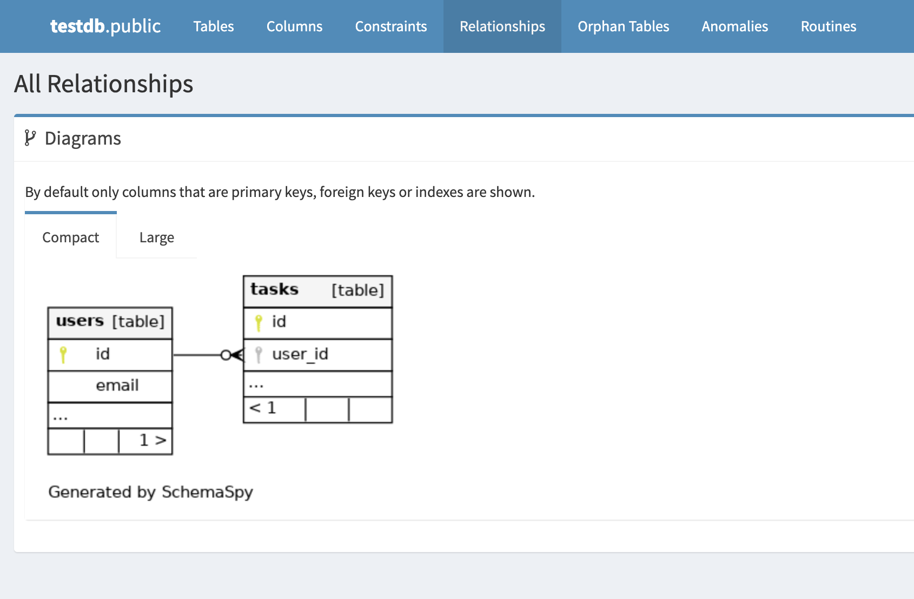
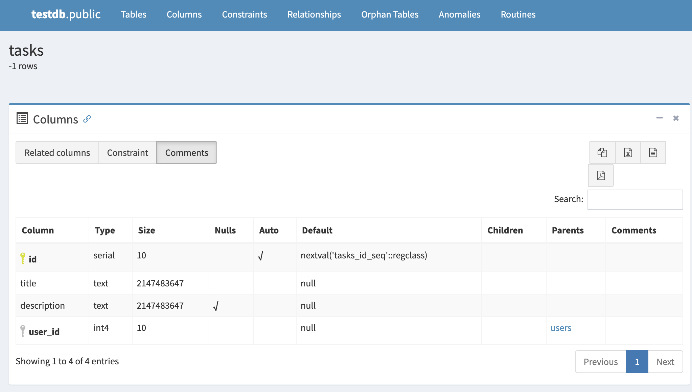

# Schemaspy

- DBドキュメントを作ってくれるツール
- mysql, postgres など対応
- Java 製
  - JDBC Driver 経由でもいける。結構なんでも出来そうだな
- 個人的に DB ドキュメントはこういう生成物で決まりだな。
  - コメントしたかったら `COMMENT ON COLUMN` を使う感じ
  - ほとんど schemaspy が生成するドキュメントで事足りる。全体像とか補足をマークダウンで書く程度
- なんか一応有名らしくて、ググって出る記事は初心者向けが多い

## スクショ

## Links
- https://speakerdeck.com/_awache/srekaigi
- https://zenn.dev/pharmax/articles/62751d51c1c9d4
