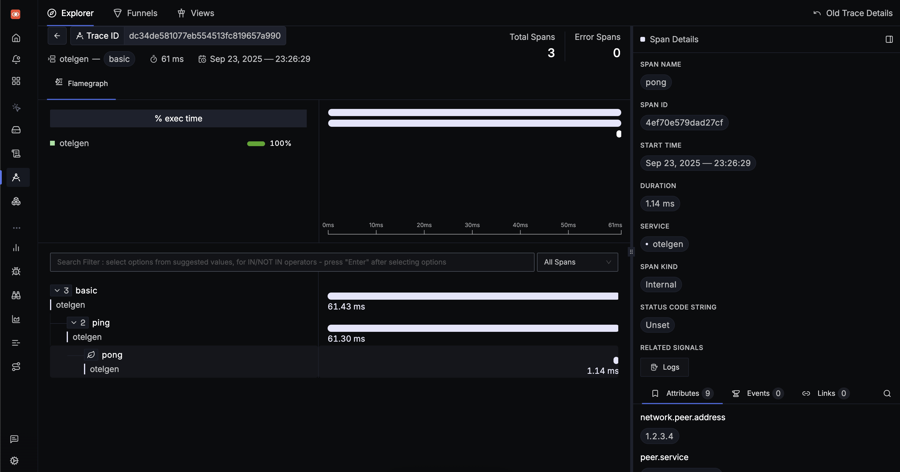

# signoz

感想は去年と同じ。
- https://github.com/enuesaa/playground-2024/tree/main/signoz-docker-try
- [docker でホストできる](https://signoz.io/docs/install/docker/#install-signoz-using-docker-compose)

otelgen でデータを生成してみた

```bash
$ otelgen --otel-exporter-otlp-endpoint localhost:4317 --insecure traces single
{"level":"info","ts":1758637589.875679,"caller":"cli/traces.go:154","msg":"starting gRPC exporter"}
{"level":"info","ts":1758637589.875987,"caller":"traces/traces.go:41","msg":"generation of traces isn't being throttled"}
{"level":"info","ts":1758637589.876058,"caller":"traces/traces.go:81","msg":"starting traces","worker":0}
{"level":"info","ts":1758637589.8760672,"caller":"traces/traces.go:83","msg":"generating scenario","worker":0,"scenario":"basic"}
{"level":"info","ts":1758637589.937378,"caller":"scenarios/basic.go:59","msg":"Trace","worker":0,"traceId":"dc34de581077eb554513fc819657a990","parentSpanId":"0f4ffd2f65fd4af3","childSpanId":"4ef70e579dad27cf","pingDuration":0.059,"pongDuration":0.001}
{"level":"info","ts":1758637589.9374988,"caller":"traces/traces.go:102","msg":"scenario completed","worker":0,"scenario":"basic","traceId":"dc34de581077eb554513fc819657a990","spanId":"9e95bb6ca765e49f"}
{"level":"info","ts":1758637589.937511,"caller":"traces/traces.go:116","msg":"traces generation completed","worker":0,"totalTraces":1}
{"level":"info","ts":1758637589.937521,"caller":"cli/traces.go:171","msg":"stop the batch span processor"}
{"level":"info","ts":1758637590.000361,"caller":"cli/traces.go:163","msg":"stopping the exporter"}
```

スクショ


