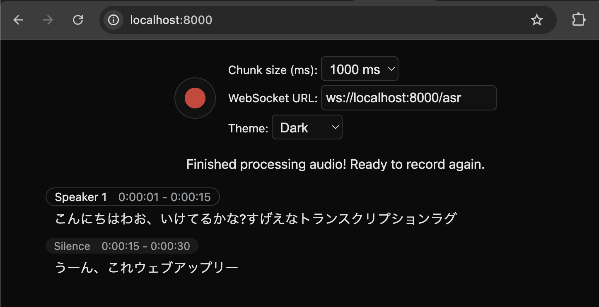

# whisper live kit

- whisper の GUI
- 字幕が表示される
- 話者識別機能があるらしい。これが凄そう？



## Commands
```bash
$ uv run whisperlivekit-server --model base --language en
INFO:     Started server process [67840]
INFO:     Waiting for application startup.
config.json: 2.31kB [00:00, 4.22MB/s]
vocabulary.txt: 460kB [00:00, 12.1MB/s]
tokenizer.json: 2.20MB [00:00, 32.9MB/s]

$ uv run whisperlivekit-server --model base --language ja
```

## Links
- https://github.com/QuentinFuxa/WhisperLiveKit
